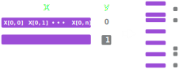
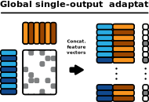
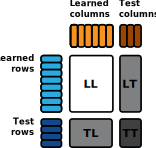

==========
User guide
==========

:mod:`bipartite_learn` is a Python package for building machine learning
models on bipartite datasets. Based on the clean and well-known API of
:mod:`scikit-learn`, it provides tools for adapting usual estimators to
bipartite tasks, as well as the implementation of several algorithms
specifically designed for such scenarios.

Bipartite machine learning tasks
================================

Sometimes we have two `X` matrices to work with
-----------------------------------------------

In a general machine learning setting, the goal is to generate an
estimator capable of predicting an outcome ``y[k]`` given an input vector
``x[k]``.

   A general binary classification task is illustrated.

   A general binary classification task is illustrated.

There are tasks, however, that consist of predicting aspects of the interaction
between two entities of different natures. For instance, drug-target interaction
prediction tasks are aimed at predicting the affinity of a drug for a given
target protein, based on chemical or biological descriptors of each. Similarly,
the goal of a recommender system is to predict how relevant would be an item to
a given user in a commercial context, based on the user's profile and the item's
characteristics.

In other words, we sometimes have two domains of objects, each being described
by its own feature matrix ``X``, and our goal is to describe these relationships
that occur only between two instances of different domains.

Since the prediction targets are the inter-domain relationships, these datasets
are naturally represented as `bipartite networks
<https://en.wikipedia.org/wiki/Bipartite_graph>`_, and our objective is to
predict edge features of such networks given the features of the interacting
nodes.

.. figure:: _static/user_guide/bipartite_dataset.svg
   :align: center
   :scale: 50 %
   :alt: A bipartite dataset
   :class: only-light

   A dataset representing a bipartite network is usually composed by two ``X``
   matrices (one for each sample domain) and an interaction matrix ``y``.

   A dataset representing a bipartite network is usually composed by two ``X``
   matrices (one for each sample domain) and an interaction matrix ``y``.

Assuming a single edge feature is being predicted, the target values of such
feature for each interacting pair of samples can be arranged in a bidimensional
matrix ``y``, where ``y[i, j]`` is the target value for the interaction between
the ``i``-th sample of the first domain and the ``j``-th sample of the second
sample domain (for example, ``y[i, j]`` could mean the affinity of the
``i``-th protein for the ``j``-drug molecule).

Each type of sample is characterized by a different set of features, so that
the first domain is represented by an ``X_0`` matrix and the second domain is
represented by a matrix ``X_1``, where each row in ``X_0`` describes a sample in
the first domain (could be a characterized protein) and each row in
``X_1`` describes a sample in the second domain (could be a drug molecule).

In a nutshell, it is sometimes desirable to
model a function in the format ``(X_0[i], X_1[j]) -> y[i, j]`` rather than the
usual ``X[k] -> y[k]`` format.

The :mod:`bipartite_learn.datasets` module provides tools to download and use
several public bipartite datasets. As an example, let's load the nuclear
neceptors dataset from `Yamanishi et al., 2008
<https://doi.org/10.1093%2Fbioinformatics%2Fbtn162>`_. This dataset assigns
binary labels to the interactions between a set of 26 nuclear receptor proteins
and a set of 54 drug molecules, whith ``y[i, j] == 1`` representing an
experimentally verified interaction while ``y[i, j] == 0`` denotes an unverified
interaction.

The feature values for each axis are respectively protein-protein and drug-drug
similarity scores, so you will notice that both ``X_0`` and ``X_1`` are square
matrices.

.. code-block:: python

    >>> from bipartite_learn.datasets import NuclearReceptorsLoader
    >>> [X_0, X_1], y = NuclearReceptorsLoader().load()
    >>> X_0.shape
    (26, 26)
    >>> X_1.shape
    (54, 54)
    >>> y.shape
    (26, 54)

.. admonition:: Summary

    *Bipartite datasets* are composed of two matrices ``X_0`` and ``X_1`` and a
    matrix ``y`` such that ``y[i, j]`` is the target value for the interaction
    between ``X_0[i]`` and ``X_1[j]``.

Bipartite estimators
--------------------

:mod:`bipartite_learn` provides machine learning estimators that directly
receive a bipartite dataset as input, formatted as described in the previous
section.

The API of these estimators is kept very similar to the usual `scikit-learn`
API, where the methods ``fit`` and ``predict`` are responsible for the training
and estimation procedures, respectively. However, some key differences must be
noted.

In their ``fit`` methods, instead of receiving a single ``X`` feature matrix
and a ``y`` target matrix, the bipartite estimators in this package are built to
receive two matrices ``X_0`` and ``X_1`` wrapped in a list ``[X_0, X_1]`` as
``fit``'s ``X`` parameter. Accordingly, the ``y`` parameter is expected to
receive the known interaction matrix, such that
``y.shape == (X[0].shape[0], X[1].shape[0])`` and ``y[i, j]`` is the target
information to be predicted about the interaction between the samples
``X[0][i]`` and ``X[1][j]``.

.. code-block:: python

    >>> from bipartite_learn.datasets import NuclearReceptorsLoader
    >>> from bipartite_learn.tree import BipartiteDecisionTreeClassifier
    >>> [X_0, X_1], y = NuclearReceptorsLoader().load()
    >>> bipartite_estimator = BipartiteDecisionTreeClassifier()
    >>> bipartite_estimator.fit([X_0, X_1], y)

Notice that although ``y`` is bidimensional, which would represent a
multi-output task for :mod:`scikit-learn` estimators, the target matrix ``y`` in
bipartite datasets essentially represents a single output per interacting pair.
These pairs themselves are what we
actually consider the input samples, so that bipartite estimators are still
considered single-output estimators even if dealing with a bidimensional ``y``.
They can be viewed as simpler (and often more efficient) methods for considering
all possible relationships during the training procedure, without the need for
explicit data preprocessing.

.. note::
    Multi-output bipartite tasks are not supported by :mod:`bipartite_learn` for
    now. In such cases, ``y`` would be most naturally represented as a
    tridimensional tensor, storing each output value along its last dimension
    (the "depth").

Even if essentially single-output under the eyes of :mod:`bipartite_learn`, some
learning algorithms for bipartite data make use of compositions of
multi-output traditional estimators (that are designed to be trained on a single
``X`` matrix).

.. note::
    For clarity sake, we refer to the usual machine learning estimators
    taking a single ``X`` matrix as *monopartite* estimators, while the ones
    that we mainly focus here, that are aware of the bipartite nature of the
    data, are accordingly called *bipartite* estimators.

However, even if components of a bipartite estimator are multi-output
monopartite models, the final bipartite estimator will always be single-output
in the sense we previously defined (this should be further clarified in the next
section).

.. note::
    :mod:`bipartite_learn` only supports **single-output** bipartite
    estimators at the moment.
    
Regarding the :meth:`predict` methods, a list of two sample sets must be
provided, similarly to what is expected by the ``fit`` method of bipartite
estimators.

Nevertheless, the output of ``bipartite_estimator.predict([X_test_0, X_test_1])``
will be the *flattened* array of predictions to each instance combination,
*not* a predicted two-dimensional interaction matrix with shape
``(X_test_0.shape[0], X_test_1.shape[0])`` as one might expect.

.. code-block:: python

    >>> from bipartite_learn.datasets import NuclearReceptorsLoader
    >>> from bipartite_learn.tree import BipartiteDecisionTreeClassifier
    >>> X, y = NuclearReceptorsLoader().load()  # X is a list of two matrices
    >>> bipartite_estimator = BipartiteDecisionTreeClassifier()
    >>> bipartite_estimator.fit(X, y)
    >>> y_pred = bipartite_estimator.predict(X)
    >>> y_pred.shape
    (1404,)
    >>> y.shape
    (26, 54)
    >>> y_pred.shape[0] == y.size
    True

Although arguably unintuitive, we adopt this behaviour in order to facilitate
integration with :mod:`scikit-learn`'s scoring utilities, which always consider
bidimensional ``y`` arrays as multi-output targets.

Another detail to pinpoint is that some of the bipartite estimators provided
are actually able to receive concatenated sample pairs as input for
:meth:`predict`, besides the general format we mentioned, of a list with two
``X`` sample sets.  This is the case of tree-based bipartite estimators in
general and the
:class:`GlobalSingleOutputWrapper` described in the following section.
Such estimators are consequently able to predict multiple specific interactions
at a single call, not subject to always computing predictions for all possible
interactions between ``X_test_0`` and ``X_test_1``.

.. admonition:: Summary

    1. While the usual single-output monopartite estimators are trained on a
       sole ``X_train`` and a single-column ``y_train``:

       .. code-block:: python

           monopartite_estimator.fit(X=X_train, y=y_train)

       bipartite estimators receive two matrices ``X_train_0`` and ``X_train_1``
       in a list, together with a ``y_train`` of shape
       ``y_train.shape == (X_train_0.shape[0], X_train_1.shape[0])``:

       .. code-block:: python

           bipartite_estimator.fit(X=[X_train_0, X_train_1], y=y_train)

    2. The ``predict()`` method of bipartite estimators always returns a
       flattened array of predictions, to facilitate scoring.

       .. code-block:: python

           bipartite_estimator.predict([X_test_0, X_test_1]).ndim == 1

Adapting monopartite estimators to bipartite datasets
-----------------------------------------------------

.. currentmodule:: bipartite_learn.wrappers

Tools are provided to adapt any :mod:`scikit-learn`-compatible estimator,
transformer or sampler to the bipartite format.

.. _global_single_output:

The global single-output approach
^^^^^^^^^^^^^^^^^^^^^^^^^^^^^^^^^

There are two general ways of working with usual monopartite estimators when
dealing with bipartite data. Arguably the most natural is to build a new
unified ``X`` matrix whose rows are taken to be concatenations of a row from
``X_0`` and a row from ``X_1``. Accordingly, the ``y`` matrix is flattened
with ``y.reshape(-1, 1)``,
yielding a unidimensional column vector as expected by single-output
monopartite models. This procedure is defined by [1]_ as the
*global single-output* approach.

   The global single-output approach. The bipartite dataset is represented as
   two matrices ``X_0`` and ``X_1``, and a matrix ``y`` of shape
   ``(X_0.shape[0], X_1.shape[0])``. The global single-output approach
   concatenates the rows of ``X_0`` and ``X_1`` to form a new ``X`` matrix,
   and flattens ``y`` to form a unidimensional ``y`` vector.

   The global single-output approach. The bipartite dataset is represented as
   two matrices ``X_0`` and ``X_1``, and a matrix ``y`` of shape
   ``(X_0.shape[0], X_1.shape[0])``. The global single-output approach
   concatenates the rows of ``X_0`` and ``X_1`` to form a new ``X`` matrix,
   and flattens ``y`` to form a unidimensional ``y`` vector.

A :class:`GlobalSingleOutputWrapper` is provided in this package to facilitate
this
procedure.

.. code-block:: python

    >>> from bipartite_learn.datasets import NuclearReceptorsLoader
    >>> from bipartite_learn.wrappers import GlobalSingleOutputWrapper
    >>> from sklearn.tree import DecisionTreeClassifier
    >>> X, y = NuclearReceptorsLoader().load()  # X is a list of two matrices
    >>> monopartite_clf = DecisionTreeClassifier()
    >>> bipartite_clf = GlobalSingleOutputWrapper(monopartite_clf)
    >>> bipartite_clf.fit(X, y)

Notice that considering all possible combinations of samples may be impeditive
in terms of memory usage or training time. Regarding memory issues, although
the transformed data is initially presented as references to avoid redundant
storage, some wrapped monopartite estimators will invariably copy the whole
dataset. For instance, :mod:`scikit-learn`'s tree-based models require the
training data to be contiguous in memory, and will copy them otherwise to
ensure that.

A common remedy to this problem is to subsample the combined pairs of samples.
The ``under_sampler`` parameter of :class:`GlobalSingleOutputWrapper` allows
for a :mod:`imbalanced-learn` sampler to be provided, which will be applied to
the converted data before fitting the wrapped estimator:

.. code-block:: python

    >>> from bipartite_learn.datasets import NuclearReceptorsLoader
    >>> from sklearn.ensemble import RandomForestClassifier
    >>> from imblearn.under_sampling import RandomUnderSampler
    >>> X, y = NuclearReceptorsLoader().load()  # X is a list of two matrices
    >>> bipartite_clf = GlobalSingleOutputWrapper(
    ...     estimator=RandomForestClassifier(),
    ...     under_sampler=RandomUnderSampler(),
    ... )
    >>> bipartite_clf.fit(X, y)
   
See the `imbalanced-learn documentation 
<https://imbalanced-learn.org/stable/under_sampling.html>`_ for more information
on samplers.

.. _local_multi_output:

The local multi-output approach
^^^^^^^^^^^^^^^^^^^^^^^^^^^^^^^

The other general approach to adapt traditional models to bipartite data is
based on the idea of considering each sample domain as a separate task, so that
a multi-output monopartite estimator is fit to ``X_train_0`` and ``y_train``
(``y_train`` being the full bidimensional interaction matrix), while another
receives ``X_train_1`` and ``y_train.T`` (the transposed interaction matrix). 

Notice that the first estimator considers each column of ``y_train`` as a
different output to be predicted, and it does not have access to any extra
information about each of the columns (aside from the training targets),
that is, it does not consider the sample features at ``X_train_1``.

Analogously, the second estimator considers each row of ``y_train`` as a
different output, withou having access to the features describing each row
(kept by ``X_train_0``).

Since the first model (trained on ``X_train_0`` and ``y_train``) estimates
new rows for the interaction matrix, we thereafter call it a
*rows estimator*.
Similarly, the second model (trained on ``X_train_1`` and ``y_train.T``) is
intended to predict new columns for the interaction matrix, so that it is
referred to as a *columns estimator*.

As estimators on each axis of the interaction matrix are completely
agnostic to the sample features on the other axis (they are "local" estimators),
this kind of strategy is called a *local multi-output* adaptation.

We hope it is now clear that the other adaptation method, the 
aforementioned *global single-output* approach, receives its name from the fact
that the
wrapped monopartite estimator expects to output a single value, and for that it
"globally" receives data from both sample domais at the same time (values from
``X_train_0`` and ``X_train_1`` are used together in training).

However, notice that the local multi-output approach as described above is still
incapable of predicting interactions if both interacting intances are not present
in the training set. In order to circumvent this limitation, a second step
involving a second pair of multi-output monopartite estimators is introduced. 

The idea is that, after the described training of a rows estimator and a
columns estimator (now called *primary* rows/columns estimator), the models
are used to extend the interaction matrix to include the new instances on each
axis, and these newly predicted rows and columns are used to train a
*secondary* columns estimator and a *secondary* rows estimator, respectively.
Finally, the predictions of the secondary estimators are combined with an
arbitrary function to yield the final predictions. This function is commonly
chosen to be the simple average between them.

The following diagram illustrates the training procedure proposed by the
multi-output strategy. Notice how the initial ``X_train_0``, ``X_train_1`` and
``y_train`` can optionally be included to train the secondary estimators,
depending if the secondary estimators are able to take advantage of possible
inter-dependencies between its multiple outputs. If each output is treated
independently in any way, one can confidently use only the predictions of the
primary estimators to build the secondary models. 

   Illustration of the training procedure under the local multi-output approach
   for adapting traditional learning algorithms to bipartite data. To be able to
   predict interactions among completely new sample pairs, this approach
   aggregates four multi-output monopartite estimators. In a first step, a
   *primary rows estimator* is trained on ``X_0`` and ``y``, and a *primary
   columns estimator* on ``X_1`` and ``y.T``. The predictions of the primary
   estimators are used to extend the interaction matrix, as shown as the step 1
   in figure (only the columns estimation is shown). The extended matrix then is
   used to train a *secondary rows estimator* and a *secondary columns
   estimator*.  Finally, the predictions of both secondary estimators are
   arbitrarily combined to yield the final predictions (the most common
   combination method is taking the simple average between both axes). Note
   that, although not necessary, one may consider using the training set also
   when training the secondary estimators, if these estimators are able to take
   advantage of possible cross-output inter-dependencies. 
   

   Illustration of the training procedure under the local multi-output approach
   for adapting traditional learning algorithms to bipartite data. To be able to
   predict interactions among completely new sample pairs, this approach
   aggregates four multi-output monopartite estimators. In a first step, a
   *primary rows estimator* is trained on ``X_0`` and ``y``, and a *primary
   columns estimator* on ``X_1`` and ``y.T``. The predictions of the primary
   estimators are used to extend the interaction matrix, as shown as the step 1
   in figure (only the columns estimation is shown). The extended matrix then is
   used to train a *secondary rows estimator* and a *secondary columns
   estimator*.  Finally, the predictions of both secondary estimators are
   arbitrarily combined to yield the final predictions (the most common
   combination method is taking the simple average between both axes). Note
   that, although not necessary, one may consider using the training set also
   when training the secondary estimators, if these estimators are able to take
   advantage of possible cross-output inter-dependencies. 

While no reconstruction of ``X`` is needed in this approach, note that the
secondary estimators must be refit every time the wrapper's :meth:`predict`
is called, increasing prediction time depending on the type of secondary
estimators chosen by the user.

We provide a :class:`LocalMultiOutputWrapper` class to easily implement this
procedure.

.. code-block:: python

    >>> from bipartite_learn.datasets import NuclearReceptorsLoader
    >>> from bipartite_learn.wrappers import LocalMultiOutputWrapper
    >>> from sklearn.tree import DecisionTreeClassifier
    >>> from sklearn.neighbors import KNeighborsClassifier
    >>> 
    >>> X, y = NuclearReceptorsLoader().load()  # X is a list of two matrices
    >>> bipartite_clf = LocalMultiOutputWrapper(
    ...     primary_rows_estimator=DecisionTreeClassifier(),
    ...     primary_cols_estimator=DecisionTreeClassifier(),
    ...     secondary_rows_estimator=KNeighborsClassifier(),
    ...     secondary_cols_estimator=KNeighborsClassifier(),
    ... )
    >>> bipartite_clf.fit(X, y)

Notice that compositions of single-output estimators can be used
instead of multi-output estimators, which can be easily implemented with 
:mod:`scikit-learn` wrappers such as :class:`MultiOutputRegressor` or
:class:`MultiOutputClassifier`. This could be an interesting option in cases
where the base estimator does not natively support multiple outputs.

.. code-block:: python

    >>> from bipartite_learn.datasets import NuclearReceptorsLoader
    >>> from bipartite_learn.wrappers import LocalMultiOutputWrapper
    >>> from sklearn.svm import SVC
    >>> from sklearn.neighbors import KNeighborsClassifier
    >>> from sklearn.multioutput import MultiOutputClassifier
    >>> 
    >>> X, y = NuclearReceptorsLoader().load()  # X is a list of two matrices
    >>> bipartite_clf = LocalMultiOutputWrapper(
    ...     primary_rows_estimator=MultiOutputClassifier(SVC()),
    ...     primary_cols_estimator=MultiOutputClassifier(SVC()),
    ...     secondary_rows_estimator=KNeighborsClassifier(),
    ...     secondary_cols_estimator=KNeighborsClassifier(),
    ... )
    >>> bipartite_clf.fit(X, y)

.. admonition:: Summary

    1. The **global single-output** approach trains a single-output
       monopartite estimator on the flattened ``y_train`` and concatenated
       instance pairs of a row from ``X_train_0`` and a row from ``X_train_1``.
    2. The **local multi-output** approach employs a composition of four
       multi-output monopartite estimators that treat rows and columns of
       ``y_train`` as different outputs to be predicted. Each has access only
       to ``X_train_0`` or to ``X_train_1``,
       not being aware of the sample features on the other axis.

.. _transformers:

Transformers and samplers
^^^^^^^^^^^^^^^^^^^^^^^^^

The :mod:`bipartite_learn.wrappers` module also provides a
:class:`MultipartiteTransformerWrapper` and a
:class:`MultipartiteSamplerWrapper`
to easily apply a pair of :mod:`scikit-learn` transformers or
:mod:`ìmbalanced-learn` samplers to the ``X`` matrix on each axis.

Native bipartite models
-----------------------

Aside from adapation utilities, we provide a collection of tree-based estimators
designed specifically to operate on bipartite data:

* :class:`bipartite_learn.tree.BipartiteDecisionTreeClassifier`
* :class:`bipartite_learn.tree.BipartiteDecisionTreeRegressor`
* :class:`bipartite_learn.tree.BipartiteExtraTreeClassifier`
* :class:`bipartite_learn.tree.BipartiteExtraTreeRegressor`
* :class:`bipartite_learn.ensemble.BipartiteRandomForestClassifier`
* :class:`bipartite_learn.ensemble.BipartiteRandomForestRegressor`
* :class:`bipartite_learn.ensemble.BipartiteExtraTreesClassifier`
* :class:`bipartite_learn.ensemble.BipartiteExtraTreesRegressor`
* :class:`bipartite_learn.ensemble.BipartiteGradientBoostingClassifier`
* :class:`bipartite_learn.ensemble.BipartiteGradientBoostingRegressor`

These algorithms applies the same split search procedure as their monopartite
versions, but separately on each axis of the bipartite data. At each tree node,
the best split in the ``y_train`` rows direction is found, then the best split
in the columns direction is found, and finally the best split is chosen between
the two. The ``criterion`` parameter options ending in ``_gso`` generates trees
with the exact same structure as the corresponding monopartite estimator wrapped
with the :class:`bipartite_learn.wrappers.GlobalSingleOutputWrapper` class, but
in a drastically faster and more memory efficient way.

The other criterion options consider a multi-output impurity function when
evaluating splits on each axis, similarly to what is done in the first step of
the local multi-output adaptation procedure. This setting corresponds to the
first ideas for a bipartite decision tree algorithm as proposed by `Pliakos et
al., 2018 <https://doi.org/10.1007/s10994-018-5700-x>`_, under the name of
Predictive Bi-Clustering Trees.
 
Since bipartite data is often sparse and positive-unlabeled, several
semi-supervised versions of these tree algorithms are also provided.
These versions explicitly include in their node impurity calculation the
distance between the samples at each partition, enabling splitting even if the
training labels are not completely representative. See [] for
more information.

Model validation
================

.. currentmodule:: bipartite_learn.model_selection

Given we are dealing with two sets of samples, validation procedures pose some
novel details to be taken into account.

To infer the performance of
a machine learning algorithm on data that was never seen before,
we usually exclude a portion of the data from the training procedure
to be used as a *test set*.

After training, the model is then applyied to predict new labels to the
hold-out ``X_test`` and we compare the predictions to
the known ``y_test`` targets that were also not used in training.

For bipartite datasets, the train-test split can occurr in both axes of the
interaction matrix, generating four possible combinations of training and test
samples: 

* LL: the training set, with learned row samples and learned column samples.
* LT: the set with learned row samples and test column samples.
* TL: the set with test row samples and learned column samples.
* TT: the pure test set, with completely unseen interaction pairs.

   The four possible train/test splits for bipartite datasets.

   The four possible train/test splits for bipartite datasets.

These mixed train/test sets, with training samples from one domain but test
samples from the other, make no sense in the more usual monopartite datasets.
Likewise, the cross-validation procedure requires slight adaptation to be
performed in bipartite scenarios.

Cross-validation and hyperparameter search
------------------------------------------

We provide a :func:`multipartite_cross_validate`
function in the :mod:`bipartite_learn.model_selection` module as a bipartite version
of :func:`sklearn.model_selection.cross_validate`. The ``cv`` parameter of
:func:`multipartite_cross_validate` can receive either a single value, to specify the
same cross-validation splitting for both axes, or a list with a value for each
axis.  The values, as in :mod:`scikit-learns`'s :func:`cross_validate`, can be
either an integer to specify a k-fold cross-validation, or an `sklearn`'s
cross-validation iterator such as :class:`KFold`, :class:`StratifiedKFold`,
:class:`LeaveOneOut`, etc. (See `Cross-Validation Iterators 
<https://scikit-learn.org/stable/modules/cross_validation.html#cross-validation-iterators>`_).

   Illustration of all 9 splits in a 3 by 3 bipartite cross-validation
   procedure.
   

   Illustration of all 9 splits in a 3 by 3 bipartite cross-validation
   procedure.
   
Additionally, the :mod:`bipartite_learn.model_selection` module also provides
adapted versions of parameter search meta-estimators, :class:`BipartiteGridSearchCV`
and :class:`BipartiteRandomizedSearchCV`, which also accept a ``cv`` parameter for each
axis.

However, one may argue that utilizing all bidimensional folds in
cross-validation may introduce more bias than the usual monopartite scenario,
because, for example, each partition of row samples will be used for testing
across multiple folds, compromising the independence of the test sets.

To mitigate this issue, the ``diagonal`` parameter of cross-validation utilities
can be set to ``True``, indicating that a given subset of samples in either axis
should be only used in a single test set. This can be visualized by disposing
the bidimensional folds in a matrix arrangement and choosing only the folds in
the main diagonal of such matrix as test sets.

   3-fold diagonal cross-validation, where test sets are ensured to be disjoint.

   3-fold diagonal cross-validation, where test sets are ensured to be disjoint.

Pipelines
---------

.. currentmodule:: bipartite_learn.pipeline

Although bipartite estimators can be seamlessly used with :mod:`scikit-learn`'s
and :mod:`imbalanced-learn`'s pipelines, the module
:mod:`bipartite_learn.pipeline` provides a :func:`make_multipartite_pipeline` 
function that automatically wraps monopartite transformers and samplers to be
applied on both sample domains (see :ref:`transformers`), so that one can
directly pass monopartite objects to it.